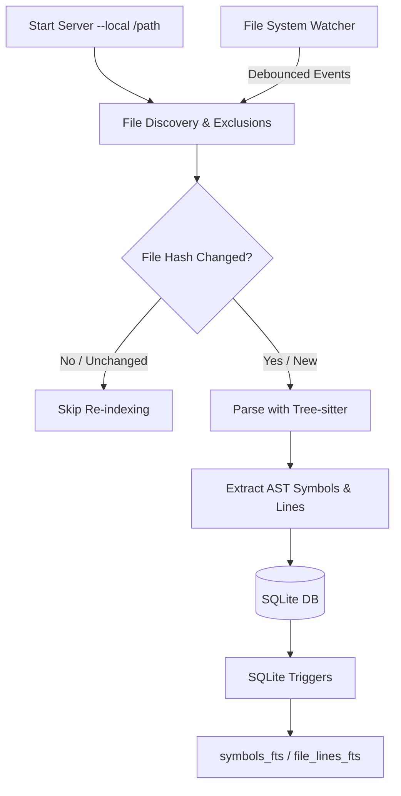
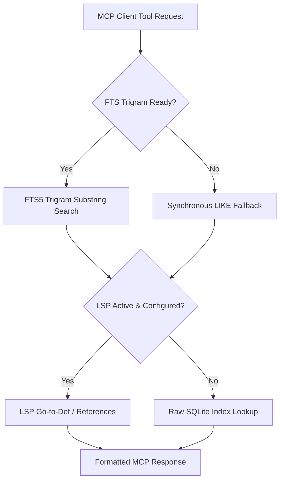

# code-search-mcp

[](https://opensource.org/licenses/MIT)
[](https://www.rust-lang.org/)
[](https://modelcontextprotocol.io)
[](#)

A high-performance Model Context Protocol (MCP) server that indexes and searches codebases using tree-sitter for rich symbol/AST extraction and SQLite FTS5 (Trigram) for blistering fast text-search and symbol resolution.

Ideal for large-scale source trees, it features first-class parser support for Java, Kotlin, C, and C++, with extended support for Go, Groovy, Gradle, Ruby, JSON, XML, YAML, AIDL, Makefiles, and other source formats.

---

## System Architecture





---

## Key Features

*   **Trigram-Powered Full-Text Search**: Replaces sluggish `LIKE '%term%'` scans with inverted SQLite FTS5 trigram indexes for sub-millisecond keyword lookup.
*   **AST Structural Queries**: Run raw tree-sitter S-expression queries against files to find complex patterns beyond regular expressions.
*   **Multi-Language Extractor**: Rich AST parser definitions spanning Java, Kotlin, C/C++, Go, Ruby, and many structural config formats.
*   **Intelligent LSP Integration**: Spawns and interacts with language servers (`jdtls`, `clangd`, etc.) on-demand to fetch precise compile-time definitions and references.
*   **Zero-Blocking Background Rebuilds**: Heavily parallelized background indexing with SQLite trigger synchronization so the server stays active immediately.
*   **Live File Watcher**: Automatic debounced incremental updates whenever source files are created, modified, or deleted.

---

## Table of Contents
- [Installation](#installation)
  - [Prerequisites](#prerequisites)
  - [Build from Source](#build-from-source)
- [Quick Start](#quick-start)
- [CLI Reference](#cli-reference)
- [Editor & Client Integrations](#editor--client-integrations)
  - [Claude Desktop](#claude-desktop)
  - [Claude CLI](#claude-cli-copilot)
  - [Gemini & Antigravity CLI](#gemini--antigravity-cli)
  - [VS Code](#using-code-search-mcp-in-vs-code)
- [MCP Tools Reference](#mcp-tools-reference)
- [Deep Dive: How Search & Indexing Works](#deep-dive-how-search--indexing-works)
- [Database Schema](#database-schema)
- [Development Commands](#development-commands)
- [License](#license)

---

## Installation

### Prerequisites
*   **Rust 1.85+** : Install via [rustup.rs](https://rustup.rs).
*   **A local codebase checkout** (e.g., AOSP checkout, your project folder).

### Build from Source
```bash
git clone https://github.com/your-org/code-search-mcp
cd code-search-mcp
cargo build --release
```
The optimized binary will be created at `target/release/code-search-mcp`.

---

## Quick Start

```bash
# 1. Index a codebase and start the MCP server on stdio (default)
./target/release/code-search-mcp --local /path/to/source

# 2. Specify a custom database storage location
./target/release/code-search-mcp --local /path/to/source --db /var/data/index.db

# 3. Start the server over Streamable HTTP transport (port 3000)
./target/release/code-search-mcp --local /path/to/source --transport http --port 3000

# 4. Query-only mode (starts instantly without indexing or writing files)
./target/release/code-search-mcp --db /var/data/index.db
```

> [!TIP]
> Indexing runs completely in the background. You can start querying the server immediately; search quality will dynamically improve as database rows populate. Use the `index_status` tool to track live progress.

---

## CLI Reference

| Flag | Env Var | Default | Description |
|:---|:---|:---|:---|
| `--local <PATH>` | `SEARCH_LOCAL_PATH` | — | Path to the source checkout directory to index and watch. |
| `--db <PATH>` | `SEARCH_DB_PATH` | `~/.code-search-mcp/index.db` | SQLite database file storage path. |
| `--transport <MODE>` | `SEARCH_TRANSPORT` | `stdio` | Transport protocol: `stdio` (interactive CLI/Desktop) or `http`. |
| `--port <PORT>` | `SEARCH_HTTP_PORT` | `3000` | HTTP port (MCP endpoint: `/mcp`; used only with `--transport http`). |
| `--index-threads <N>`| `SEARCH_INDEX_THREADS`| *CPU Cores* | Maximum parallel indexing workers. |
| `--no-watch` | — | `false` | Disable the file watcher for incremental file updates. |
| `--no-fts-rebuild` | — | `false` | Skip the background FTS trigram index builder (runs query-only text searches). |
| `--allow-remote` | `SEARCH_ALLOW_REMOTE` | `false` | Allow remote connections / any Host header (disables host validation). |

Enable verbose logging by prefixing execution with `RUST_LOG=debug`.

---

## Editor & Client Integrations

### Claude Desktop
Add this server block to your `claude_desktop_config.json`:

```json
{
  "mcpServers": {
    "code-search": {
      "command": "/path/to/code-search-mcp",
      "args": ["--local", "/path/to/source"],
      "env": {
        "SEARCH_INDEX_THREADS": "8"
      }
    }
  }
}
```

#### Configuration Locations:
*   **macOS**: `~/Library/Application Support/Claude/claude_desktop_config.json`
*   **Linux**: `~/.config/Claude/claude_desktop_config.json`
*   **Windows**: `%APPDATA%\Claude\claude_desktop_config.json`

---

### Claude CLI (Copilot)
Start the server in HTTP mode, then register it via GitHub CLI:
```bash
./code-search-mcp --local /path/to/source --transport http --port 3000 &
gh copilot mcp add code-search http://localhost:3000/mcp
```
Or configure it as a standard `stdio` command server directly in your `~/.copilot/mcp.json`.

---

### Gemini & Antigravity CLI
You can integrate the server directly with the **Antigravity CLI (and Antigravity 2.0 Desktop)** or the older **Gemini CLI** using the shared agent harness.

#### Antigravity CLI & Desktop
Shared configurations are stored in the central `mcp_config.json` file.
*   **Location**: `~/.gemini/config/mcp_config.json` (or click **Manage MCP Servers > View raw config** in the agent UI panel).

Add the following config configuration:
```json
{
  "mcpServers": {
    "code-search": {
      "command": "/path/to/code-search-mcp",
      "args": [
        "--local",
        "/path/to/source"
      ],
      "env": {
        "SEARCH_INDEX_THREADS": "8"
      }
    }
  }
}
```

#### Gemini CLI (Legacy)
*   **Location**: `~/.gemini/settings.json`

```json
{
  "mcpServers": {
    "code-search": {
      "command": "/path/to/code-search-mcp",
      "args": [
        "--local",
        "/path/to/source"
      ]
    }
  }
}
```

---

### Using `code-search` MCP In VS Code
You can connect this project to any MCP-supporting VS Code client (e.g. Cursor or VS Code MCP plugin) using either a **Stdio** or **HTTP** configuration inside `.vscode/mcp.json`.

#### Option A: Stdio Connection (Recommended)
This runs the binary automatically whenever your editor workspace loads:
```json
{
  "servers": {
    "code-search": {
      "command": "/path/to/code-search-mcp",
      "args": ["--local", "/path/to/source"],
      "type": "stdio"
    }
  },
  "inputs": []
}
```

#### Option B: HTTP Streamable Connection
Ideal for debugging, this connects to an already running background server.

1.  **Start the Server**:
    ```bash
    ./target/release/code-search-mcp --local /path/to/source --transport http --port 3000
    ```
2.  **Configure `.vscode/mcp.json`**:
    ```json
    {
      "servers": {
        "code-search": {
          "url": "http://localhost:3000/mcp",
          "type": "http"
        }
      },
      "inputs": []
    }
    ```

#### Validate the connection
Call the `index_status` tool to verify the connection. Once connected, use `search_symbols` or `search_text` to explore!

---

## MCP Tools Reference

The server registers exactly **8 active tools** (implemented in `src/tools/` and exposed via the main server module). Below is the complete listing and documentation for every registered tool:

### 1. `search_symbols`
Search for symbols (classes, methods, functions, properties, structs) by name or glob pattern.

#### Parameters:
*   `query` (string, **Required**): Symbol name or glob pattern (e.g. `Activity`, `on*`, `Binder*`).
*   `language` (string, *Optional*): Filter by language key (e.g. `java`, `kotlin`, `c`, `cpp`, `go`, `groovy`, `gradle`, `rb`, `json`, `xml`, `yaml`, `aidl`, `make`).
*   `kind` (string, *Optional*): Filter by kind: `class`, `method`, `function`, `field`, `property`, `struct`, `enum`, `interface`.
*   `limit` (number, *Optional*): Maximum result limit (Default: 50, Max: 500).

```json
// Request
{ "query": "ActivityManager", "language": "java", "kind": "class" }

// Response
[
  {
    "name": "ActivityManager",
    "kind": "class",
    "container": "android.app",
    "file": "frameworks/base/core/java/android/app/ActivityManager.java",
    "language": "java",
    "start_line": 142,
    "start_col": 0,
    "signature": ""
  }
]
```

---

### 2. `go_to_definition`
Find where a specific symbol is defined. Leverages active LSP servers for precision when available, falling back seamlessly to SQLite database definitions.

#### Parameters:
*   `symbol` (string, **Required**): Exact case-sensitive name of the symbol.
*   `language` (string, *Optional*): Narrow search scope to a language.
*   `container` (string, *Optional*): Narrow search scope to a class/module namespace.

```json
// Request
{ "symbol": "startActivity", "language": "java" }
```

---

### 3. `find_references`
Find all usages/references of a symbol. Backed by active LSP clients when possible; falls back to full-text indices.

#### Parameters:
*   `symbol` (string, **Required**): Symbol name.
*   `language` (string, *Optional*): Restrict references to a single language.
*   `limit` (number, *Optional*): Maximum result count (Default: 100, Max: 500).

```json
// Request
{ "symbol": "Binder", "language": "java", "limit": 50 }

// Response
[
  {
    "file": "frameworks/base/core/java/android/os/ServiceManager.java",
    "line_no": 87,
    "content": "    IBinder binder = ServiceManager.getService(\"activity\");",
    "language": "java"
  }
]
```

---

### 4. `search_text`
Run full-text searches across all indexed source files. Extremely fast trigram matching with optional regex filter passes.

#### Parameters:
*   `query` (string, **Required**): Plain-text keyword or regular expression pattern.
*   `regex` (boolean, *Optional*): Treat query as a regex pattern (Default: `false`).
*   `language` (string, *Optional*): Restrict search to a language.
*   `path_filter` (string, *Optional*): Path substring filter (e.g. `frameworks/base`).
*   `limit` (number, *Optional*): Max results (Default: 100, Max: 1000).
*   `context_lines` (number, *Optional*): Number of context lines to return around matching lines (Default: 2, Max: 10).

```json
// Request
{ "query": "void on\\w+\\(", "regex": true, "language": "java" }
```

---

### 5. `list_files`
List all indexed files, optionally filtered by path strings or language.

#### Parameters:
*   `path_filter` (string, *Optional*): Path substring or glob pattern (e.g. `*.java`).
*   `language` (string, *Optional*): Filter by language.
*   `limit` (number, *Optional*): Max results (Default: 200, Max: 2000).

---

### 6. `read_file`
Read the complete string content of a source file directly from the filesystem.

#### Parameters:
*   `file_path` (string, **Required**): Absolute path to the file on disk.

```json
// Request
{ "file_path": "/Users/tnguyen/code-search-mcp/src/main.rs" }

// Response
{
  "content": "pub struct Cli { ... }"
}
```

---

### 7. `ast_query`
Execute a tree-sitter S-expression structural query directly against a specific source file. This bypasses text searches to locate complex structural grammar definitions.

#### Parameters:
*   `file_path` (string, **Required**): Absolute path to the source file.
*   `pattern` (string, **Required**): Tree-sitter S-expression query pattern.

```json
// Request (Find all method definitions in an Activity file)
{
  "file_path": "/aosp/frameworks/base/core/java/android/app/Activity.java",
  "pattern": "(method_declaration name: (identifier) @method.name)"
}

// Response
[
  {
    "capture_name": "method.name",
    "text": "onCreate",
    "start_line": 989,
    "start_col": 17,
    "end_line": 989,
    "end_col": 25
  }
]
```

> [!TIP]
> Refer to the official [tree-sitter query documentation](https://tree-sitter.github.io/tree-sitter/using-parsers#pattern-matching-with-queries) for full expression syntax.

---

### 8. `index_status`
Retrieve server indexing statistics, diagnostics, and language distribution counts.

```json
// Response
{
  "status": "indexing",
  "total_files": 142500,
  "indexed_files": 38200,
  "total_symbols": 1850000,
  "files_by_language": { "java": 22100, "cpp": 11400, "c": 3800, "kotlin": 900 },
  "symbols_by_kind": { "method": 980000, "class": 120000, "function": 450000 },
  "errors": 0
}
```

> [!NOTE]
> *Why are there 9 files in `src/tools/` but only 8 tools registered?*  
> The `src/tools/` directory contains `mod.rs`, which is simply the Rust module configuration file grouping the imports together. There are exactly 8 distinct functional tools registered inside the main server handler and exposed over the MCP protocol.

---

## Deep Dive: How Search & Indexing Works

Use this mental model to understand how `code-search-mcp` coordinates its systems:

### 1. The Indexing Pipeline
*   **Discovery**: The server scans your `--local` directory recursively, filtering files by extension and checking `.gitignore` exclusions.
*   **Incremental Hashing**: Files are MD5/SHA hashed. If the database already holds an identical hash for a file, it skips it entirely.
*   **AST Symbol Extraction**: High-performance tree-sitter parsers run against the code, compiling structures into `symbols` rows (`name`, `kind`, `container`, `signature`, lines).
*   **Line Mapping**: File contents are broken down into individual lines inside `file_lines` for text search.
*   **Trigger Sync**: SQLite triggers dynamically mirror rows from `symbols` and `file_lines` into their respective virtual FTS5 index tables (`symbols_fts` and `file_lines_fts`).

### 2. The Query Pipeline
*   `search_symbols` queries the `symbols_fts` index directly for sub-millisecond glob/prefix matching.
*   `ast_query` reads a file directly from disk in real-time, parses it, and evaluates your custom S-expression query.
*   `go_to_definition` & `find_references` first check the SQLite index tables. If a supported language server (LSP) is active, it routes JSON-RPC requests directly to the language server to fetch accurate compile-time details, guaranteeing precision.

---

## Database Schema

SQLite schema definition used for data storage:

| Table | Column / Attributes | Description |
|:---|:---|:---|
| **`files`** | `id`, `path` (Unique), `language`, `mtime`, `hash` | Master index of tracked codebase source files. |
| **`symbols`** | `id`, `file_id` (FK), `name`, `kind`, `start_line`, `start_col`, `container` | AST-extracted code symbols. |
| **`symbols_fts`** | *FTS5 Virtual Table* | Fast full-text lookup for symbol name, container, and kind. |
| **`file_lines`** | `file_id` (FK), `line_no`, `content` | Split raw line contents of all tracked files. |
| **`file_lines_fts`**| *FTS5 Virtual Table (Trigram)* | Overlapping 3-character tokenizer for substring matching. |
| **`index_progress`**| `key` (PK), `value` | Tracks live state metrics (`status`, `total_files`). |

---

## Development Commands

Validate code and run tests locally during development:
```bash
# Debug build
cargo build

# Release optimized build
cargo build --release

# Run unit and integration tests
cargo test

# Run the server with verbose logging
RUST_LOG=debug ./target/release/code-search-mcp --local /path/to/source
```

> [!NOTE]
> Large files (> 2 MB), non-UTF-8 source files, and build directories (`out/`, `.repo/`, `target/`) are automatically excluded from indexing.
